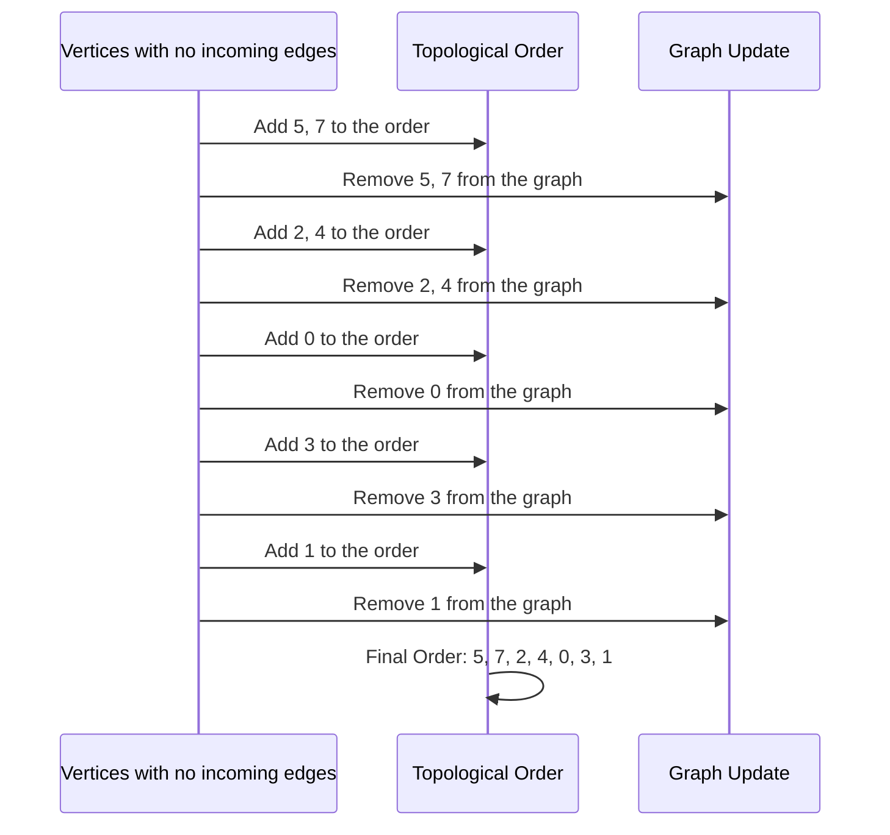

# ALGORITHMS

## Time Complexity

To fully understand algorithms we must understand how to evaluate the time an algorithm needs to do its job, the runtime.

When considering the runtime for different algorithms, we will not look at the actual time an implemented algorithm uses to run, and here is why.

If we implement an algorithm in a programming language, and run that program, the actual time it will use depends on many factors:

the programming language used to implement the algorithm

- how the programmer writes the program for the algorithm
- the compiler or interpreter used so that the implemented algorithm can run
- the hardware on the computer the algorithm is running on
- the operating system and other tasks going on on the computer
- the amount of data the algorithm is working on

With all these different factors playing a part in the actual runtime for an algorithm, how can we know if one algorithm is faster than another? We need to find a better measure of runtime.

> To evaluate and compare different algorithms, instead of looking at the actual runtime for an algorithm, it makes more sense to use something called time complexity.

<u>**Big O Notation**</u><br>

In mathematics, Big O notation is used to describe the upper bound of a function.

In computer science, Big O notation is used more specifically to find the worst case time complexity for an algorithm.

Big O notation uses a capital letter O with parenthesis O () , and inside the parenthesis there is an expression that indicates the algorithm runtime. Runtime is usually expressed using n , which is the number of values in the data set the algorithm is working on.

Below are some examples of Big O notation for different algorithms, just to get the idea:

| Time Complexity | Algorithm                                                                                                                                                                                                                                                                                                                                                   |
| --------------- | ----------------------------------------------------------------------------------------------------------------------------------------------------------------------------------------------------------------------------------------------------------------------------------------------------------------------------------------------------------- |
| $O(1)$          | Looking up a specific element in an array, like this for example: `print( my_array[97] )` No matter the size of the array, an element can be looked up directly, it just requires one operation. (This is not really an algorithm by the way, but it can help us to understand how time complexity works.)                                                  |
| $O(n)$          | Finding the lowest value. The algorithm must do $n$ operations in an array with $n$ values to find the lowest value, because the algorithm must compare each value one time.                                                                                                                                                                                |
| $O(n^2)$        | Bubble sort, Selection sort and Insertion sort are algorithms with this time complexity. The reason for their time complexities are explained on the pages for these algorithms. Large data sets slows down these algorithms significantly. With just an increase in $n$ from 100 to 200 values, the number of operations can increase by as much as 30000! |
| $O(n \\log n)$  | The Quicksort algorithm is faster on average than the three sorting algorithms mentioned above, with $O(n \\log n)$ being the average and not the worst case time. Worst case time for Quicksort is also $O(n^2)$, but it is the average time that makes Quicksort so interesting. We will learn about Quicksort later.                                     |

In Mathematics, Big O notation is used to create an upper bound for a function, and in Computer Science, Big O notation is used to describe how the runtime of an algorithm increases when the number of data values n increase.

For example, consider the function:

$$
f ( n) = 0.5 n^3 − 0.75 n^2 + 1
$$

Asymptotic Notations:

$\Omega (n)$ : Describes the lower bound of a function. Where the alorithm's original time complexity can be $C(n) \geq \Omega(n)$ <br>
$\omega(n)$ : Describes the stric lower bound of a function. $C(n) > \omega(n)$ <br>
$𝑂(𝑛)$ : Describes the upper bound of a function. $C(n) \leq O(n)$<br>
$o(n)$ : Describe the strict upper bound of a function. $C(n) < o(n)$ <br>
$\Theta(𝑛)$ : Describes a tight bound (both upper and lower bounds) of a function. $C(n) = \Theta(n)$<br>

**Definition**

Let $f ( n)$ and $g ( n)$ be two functions. We say that $f ( n)$ is $O ( g ( n))$ if and only if there are positive constants $C$ and $n_0$ such that $C ⋅ g ( n) > f ( n)$ for all $n > n_0$ .

## Tree Traversals

Consider this binary tree

```
                                    A(50)
                        -------------------------------
                        |                             |
                        V                             V
                      B(25)                         C(75)
                -----------------              ----------------
                |               |              |              |
                V               V              V              V
              D(15)           E(40)          F(60)          G(90)
            ---------      ---------       ---------      ----------
            |       |      |       |       |       |      |        |
            V       V      V       V       V       V      V        V
          H(10)   I(20)  J(30)   K(45)   L(55)   M(70)  N(80)    O(100)

Where the Alphabetets are the names of the nodes and in the braces,
the value of each node is given.

Fig: Grp1
```

### Pre-order Traversal

Pre-order Traversal is done by visiting the root node first, then recursively do a pre-order traversal of the left subtree, followed by a recursive pre-order traversal of the right subtree. It's used for creating a copy of the tree, prefix notation of an expression tree, etc.

The priority of nodes are, parent node > left node > right node.

The preorder traversal for the graph in figure is given as

$$
A \rightarrow B \rightarrow D \rightarrow H \rightarrow I \rightarrow E \rightarrow J \rightarrow K  C \rightarrow F \rightarrow L \rightarrow M \rightarrow G \rightarrow N \rightarrow O
$$

### In-order Traversal

The In-order traversal give the nodes in a BST in sorted order. i.e., in the BST, the left most deepest node is returned first, then the right node to that parent node, then the parent node and returns back to the root node then only it give the root node. The priority of the node is give to the left most node only, the parent node then the right node.

The priority of nodes are, left node > parent node > right node.

The In-order traversal for the graph in figure is given as

$$
H \rightarrow D \rightarrow I \rightarrow B \rightarrow J \rightarrow E \rightarrow K \rightarrow A \rightarrow L \rightarrow F \rightarrow M \rightarrow C \rightarrow N \rightarrow G \rightarrow O
$$

In value of the node order

$$
(H)10 \rightarrow (D)15 \rightarrow (I)20 \rightarrow (B)25 \rightarrow (J)30 \rightarrow (E)40 \rightarrow (K)45 \rightarrow (A)50 \rightarrow \\
(L)55 \rightarrow (F)60 \rightarrow (M)70 \rightarrow (C)75 \rightarrow (N)80 \rightarrow (G)90 \rightarrow (O)100
$$

### Post-order Traversal

In post-order traversal, the left sub-tree with no unexplored child nodes or leaf nodes are explored first, then after the nodes are explored, a node with explored child nodes will become a node without no unexplored child nodes.

The priority of nodes are left node > right node > parent node

$$
H \rightarrow I \rightarrow D \rightarrow J \rightarrow K \rightarrow E \rightarrow B \rightarrow L \rightarrow M \rightarrow F \rightarrow N \rightarrow O \rightarrow G \rightarrow C \rightarrow A.
$$

### Level-order Traversal

This traversal is used in Breadth Frist Search(BFS) algorithm, where all the nodes in a level are explored and only then the next level is explored. <br>
The level order traversal for the graph in figure **Grp1** is given Below

$$
A \rightarrow B \rightarrow C \rightarrow D \rightarrow E \rightarrow F \rightarrow G \rightarrow H \rightarrow I \rightarrow J \rightarrow K \rightarrow L \rightarrow M \rightarrow N \rightarrow O
$$

## Graphs

There is a possibility of loops in this graph.

## Directed Acyclic Graph(DAG)

### Topological Sort

It is a linear ordering of a graphs vertices, such that for every directed edge `uv` for vertex `u` to `v`, `u` comes before vertex `v` in the ordering.

> 1. Graph should be a DAG <br>
> 2. Every Graph will have atlease one topological sort

In-degree : The number of edges coming into the vertex<br>
out-degree : The number of edges going out from the vertex.

**Algorithm**

1. Find the in-degree of each vertex of the DAG.
2. Find the vertex with in-degree 0 and add it to a list.
3. Remove the node with 0 in-degree and begin from step 1 with the new DAG with removed vertex.

Keep adding all the vertex in from the new DAG's to create a ordered list of vertices.



## Divide And Conqure

The Divide and Conqure algorithms are named after the partitioning process that goes on in during sorting. A pivot element is cosidered and based on the pivot element we divide the whole array into sub-arrays and recursively we divide those sub-arrays too till we achieve atomic level and then we find the sorted array.

### Quick Sort

In this sorting algorithm, a pivot element is considered and all the element less then or equal to the pivot element are put in left side of the array and all the element greater than the pivot are put in the right side of the array.

In order to ensure stability in Quicksort, elements equal to the pivot should remain in their original relative order. This can be achieved by partitioning in such a way that all elements ≤ 𝑝 are on the left side, and all elements > 𝑝 are on the right side of the pivot 𝑝 .

After a single partition is performed, the pivot element is positioned in it's approprioate place in the array and we have two different array to sort now.

Again perfrom the quicksort algorithm on the two sub-array, untill all the element are sorted and all the pivot elements are given their approprioate positions.

| **Algorithm**  | **Best Case** | **Average Case** | **Worst Case** |
| -------------- | ------------- | ---------------- | -------------- |
| **Merge Sort** | $O(n log n)$  | $O(n log n)$     | $O(n log n)$   |
| **Quick Sort** | $O(n log n)$  | $O(n log n)$     | $O(n^2)$       |

## Reference

1. Stuart Russell, Peter Norvig: Artificial Intelligence: A Modern Approach (4th Edition). Pearson 2020
2. [W3Schools](https://www.w3schools.com/dsa/dsa_timecomplexity_theory.php)
