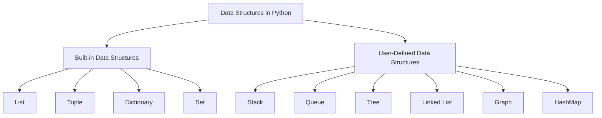

# DATA STRUCTURES

```python
sequence[start:stop:step]
```

 <!-- BUG: Not working-->



## Built-in Data Structures

- Built-in data structures in Python can be divided into two broad categories: **mutable** and **immutable**.
- Mutable data structures are those which we can modify – for example, by adding, removing, or changing their elements. Python has three mutable data structures: **lists**, **dictionaries**, and **sets**.
- Immutable data structures, on the other hand, are those that we cannot modify after their creation. The only basic built-in immutable data structure in Python is a **tuple**.

<!-- TODO: Add the build-in ds to notes-->

## User Defined Data Structures

<!-- TODO: Add notes from pw-->

### Hash Table

Load Factor: A ratio that that indicated how full the table. If `a` is the load factor then, $0 \leq a \leq 1$. 0 when the Hash table is empty, 1 when it's full.
