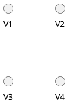

# GRAPH THEORY

### What is a Graph?

A Graph is a non-linear data structure consisting of vertices and edges. The vertices are sometimes also referred to as nodes and the edges are lines or arcs that connect any two nodes in the graph. More formally a Graph is composed of a set of vertices( V ) and a set of edges( E ). The graph is denoted by G(V, E).

### Key Concepts

- **Degree**: The number of edges connected to a node. In directed graphs, we distinguish between in-degree (edges coming into the node) and out-degree (edges going out from the node).
- **Path**: A sequence of edges that connect a sequence of distinct nodes.
- **Cycle**: A path that starts and ends at the same node.
- **Connected Graph**: In an undirected graph, a graph is connected if there is a path between every pair of nodes.
- **Subgraph**: A graph formed from a subset of the nodes and edges of another graph.

### Types of Graphs

1. **Trivial Graph**: A graph with only a single vertex and no edges. It is the simplest possible graph.
2. **Null Graph**: A graph with no edges at all, but it can have multiple vertices. In other words, a null graph is a set of isolated vertices with no connections.

3. **Directed Graph (Digraph)**: The edges have a direction. If there's an edge from A to B, you can travel from A to B but not necessarily from B to A.

   

4. **Undirected Graph**: A graph in which edges have no direction, indicating a two-way relationship.

   

5. **Complete Graph**: A graph in which there is an edge between every pair of vertices. In a complete graph with $n$ vertices, each vertex is connected to every other vertex.
6. **Weighted Graph**: A graph where each edge has a numerical weight associated with it, representing the cost, distance, or some other attribute.
7. **Connected Graph**: A graph in which there is a path between any two vertices, ensuring that every vertex is reachable from any other vertex.
8. **Tree**: A connected, acyclic graph, essentially a graph without cycles. Trees have a hierarchical structure, and each node (except the root) has exactly one parent node.
9. **Bipartite Graph**: A graph whose vertices can be divided into two disjoint sets such that no two vertices within the same set are adjacent.
