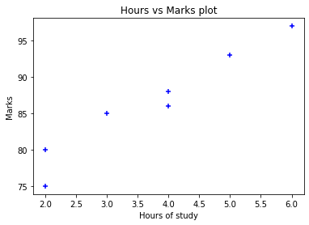
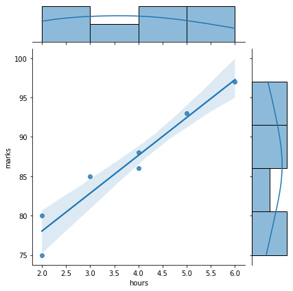

# Linear Regression


```python
import numpy as np
import pandas as pd
import matplotlib.pyplot as plt
import seaborn as sns
from sklearn import linear_model
%matplotlib inline
```


```python
temp = {'hours': [2, 3, 5, 2, 4, 6, 4], 'marks': [80, 85, 93, 75, 88, 97, 86]}
data = pd.DataFrame(temp)
data
```


<div>
<style scoped>
    .dataframe tbody tr th:only-of-type {
        vertical-align: middle;
    }

    .dataframe tbody tr th {
        vertical-align: top;
    }

    .dataframe thead th {
        text-align: right;
    }
</style>
<table border="1" class="dataframe">
  <thead>
    <tr style="text-align: right;">
      <th></th>
      <th>hours</th>
      <th>marks</th>
    </tr>
  </thead>
  <tbody>
    <tr>
      <th>0</th>
      <td>2</td>
      <td>80</td>
    </tr>
    <tr>
      <th>1</th>
      <td>3</td>
      <td>85</td>
    </tr>
    <tr>
      <th>2</th>
      <td>5</td>
      <td>93</td>
    </tr>
    <tr>
      <th>3</th>
      <td>2</td>
      <td>75</td>
    </tr>
    <tr>
      <th>4</th>
      <td>4</td>
      <td>88</td>
    </tr>
    <tr>
      <th>5</th>
      <td>6</td>
      <td>97</td>
    </tr>
    <tr>
      <th>6</th>
      <td>4</td>
      <td>86</td>
    </tr>
  </tbody>
</table>
</div>


```python
# scatter plots using matplotlib and seaborn
plt.xlabel('Hours of study')
plt.ylabel('Marks')
plt.title("Hours vs Marks plot")
plt.scatter(data.hours, data.marks, color='blue', marker="+")
```


    <matplotlib.collections.PathCollection at 0x7ffab11e9a50>


    

    


```python
sns.jointplot(data=data, x='hours', y = 'marks', kind='reg')
```


    <seaborn.axisgrid.JointGrid at 0x7ffab1597880>


    

    


```python
reg = linear_model.LinearRegression()
reg.fit(data[['hours']], data.marks)
```


    LinearRegression()


```python
reg.predict([[3.5]])
```

    /home/balaji/Documents/Python/venv/lib/python3.10/site-packages/sklearn/base.py:450: UserWarning: X does not have valid feature names, but LinearRegression was fitted with feature names
      warnings.warn(


    array([85.25531915])


```python
reg.coef_
```


    array([4.80851064])


```python
reg.intercept_
```


    68.42553191489363


The equation is

Y = 4.8X + 68.42 


```python
lst = [2, 3, 4, 2.5, 3.5]
reg.predict([[i] for i in lst])
```

    /home/balaji/Documents/Python/venv/lib/python3.10/site-packages/sklearn/base.py:450: UserWarning: X does not have valid feature names, but LinearRegression was fitted with feature names
      warnings.warn(


    array([78.04255319, 82.85106383, 87.65957447, 80.44680851, 85.25531915])


```python
data['hours']
```


    0    2
    1    3
    2    5
    3    2
    4    4
    5    6
    6    4
    Name: hours, dtype: int64


```python
data[['hours']]
```


<div>
<style scoped>
    .dataframe tbody tr th:only-of-type {
        vertical-align: middle;
    }

    .dataframe tbody tr th {
        vertical-align: top;
    }

    .dataframe thead th {
        text-align: right;
    }
</style>
<table border="1" class="dataframe">
  <thead>
    <tr style="text-align: right;">
      <th></th>
      <th>hours</th>
    </tr>
  </thead>
  <tbody>
    <tr>
      <th>0</th>
      <td>2</td>
    </tr>
    <tr>
      <th>1</th>
      <td>3</td>
    </tr>
    <tr>
      <th>2</th>
      <td>5</td>
    </tr>
    <tr>
      <th>3</th>
      <td>2</td>
    </tr>
    <tr>
      <th>4</th>
      <td>4</td>
    </tr>
    <tr>
      <th>5</th>
      <td>6</td>
    </tr>
    <tr>
      <th>6</th>
      <td>4</td>
    </tr>
  </tbody>
</table>
</div>


```python
# linear regression using statsmodels
from statsmodels.formula.api import ols
```


```python
lr = ols('marks ~ hours', data)
```


```python
lrm = lr.fit()
lrm.summary2()
```

    /home/balaji/Documents/Python/venv/lib/python3.10/site-packages/statsmodels/stats/stattools.py:74: ValueWarning: omni_normtest is not valid with less than 8 observations; 7 samples were given.
      warn("omni_normtest is not valid with less than 8 observations; %i "


<table class="simpletable">
<tr>
        <td>Model:</td>               <td>OLS</td>         <td>Adj. R-squared:</td>     <td>0.924</td> 
</tr>
<tr>
  <td>Dependent Variable:</td>       <td>marks</td>             <td>AIC:</td>          <td>31.5341</td>
</tr>
<tr>
         <td>Date:</td>        <td>2022-02-19 23:30</td>        <td>BIC:</td>          <td>31.4259</td>
</tr>
<tr>
   <td>No. Observations:</td>          <td>7</td>          <td>Log-Likelihood:</td>    <td>-13.767</td>
</tr>
<tr>
       <td>Df Model:</td>              <td>1</td>           <td>F-statistic:</td>       <td>74.15</td> 
</tr>
<tr>
     <td>Df Residuals:</td>            <td>5</td>        <td>Prob (F-statistic):</td> <td>0.000349</td>
</tr>
<tr>
      <td>R-squared:</td>            <td>0.937</td>            <td>Scale:</td>         <td>4.1872</td> 
</tr>
</table>
<table class="simpletable">
<tr>
      <td></td>       <th>Coef.</th>  <th>Std.Err.</th>    <th>t</th>     <th>P>|t|</th> <th>[0.025</th>  <th>0.975]</th> 
</tr>
<tr>
  <th>Intercept</th> <td>68.4255</td>  <td>2.2136</td>  <td>30.9116</td> <td>0.0000</td> <td>62.7353</td> <td>74.1157</td>
</tr>
<tr>
  <th>hours</th>     <td>4.8085</td>   <td>0.5584</td>  <td>8.6112</td>  <td>0.0003</td> <td>3.3731</td>  <td>6.2439</td> 
</tr>
</table>
<table class="simpletable">
<tr>
     <td>Omnibus:</td>      <td>nan</td>   <td>Durbin-Watson:</td>   <td>1.393</td>
</tr>
<tr>
  <td>Prob(Omnibus):</td>   <td>nan</td>  <td>Jarque-Bera (JB):</td> <td>0.458</td>
</tr>
<tr>
       <td>Skew:</td>     <td>-0.418</td>     <td>Prob(JB):</td>     <td>0.795</td>
</tr>
<tr>
     <td>Kurtosis:</td>    <td>2.066</td>  <td>Condition No.:</td>    <td>12</td>  
</tr>
</table>


```python
lrm.params
```


    Intercept    68.425532
    hours         4.808511
    dtype: float64


```python
lrm.predict({'hours':[2, 3, 4, 2.3, 4.5,5.2]})
```


    0    78.042553
    1    82.851064
    2    87.659574
    3    79.485106
    4    90.063830
    5    93.429787
    dtype: float64


```python

```
