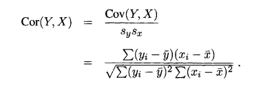
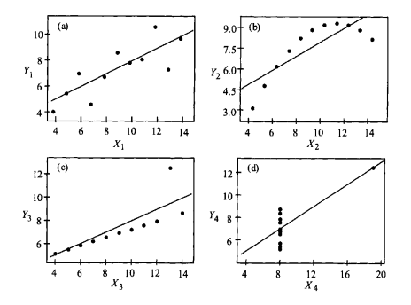

## Linear Regression

To measure the direction and the strenght of the relationship between Y and X, we find covariance and the correlation coefficient.

**Variance:** Variance is a measurement of the spread between numbers in a data set. THe variance of a variable tells, what is the average of the square of distance from the mean to each of the element. In case of another data with same mean, to find the spread of numbers, we use this measure to compare.

**Covariance:** Covariance is a measure of how much two random variables vary together. It’s similar to variance, but where variance tells you how a single variable varies, co variance tells you how two variables vary together.

$cov_{x,y}=\frac{\displaystyle\sum_{i=1}^{n}(x_{i}-\bar{x})(y_{i}-\bar{y})}{N-1}$

Note: The population covariance is the same fomula, except `N` instead on `N - 1`. For any estimator of population parameter related to despersion, it is taken `N - 1`, as this extimator is found to be unbiased, consistent, efficient, and sufficient.

Covariance tells what is the direction of one variable with respect to the another. If the covariance if positive, the relation is directly proportional, if not, inversely proportional. We can see that, variance of x is nothing but, covariance of x with itself. In two variable point of view, the relation is always positive, and it indicates the average distance among the elements from mean, where as in two different variables, it cannot be assigned to a quality, it just indicates the direction of the relationship. This measure can also indicate the strength of the relationship, but unfortunately the highest number is not fixed, so there is no particular limit where we can say this relationship has good strength.

Taking an example of positive slope for a scatter plot, and using the covariance equaiton, we can see that the value generated at each point is positive and incase of negetive slope, the values generated are negetive. So instead of looking at the graph for a larger data sets, we can caluculate the covariance and emphasize the direction of the relation more efficiently(moreover with a certain quantitative mearure indicating the rate of the proportionality).

**Correlation**: Similar to covariance, correlation also indecates the direction relationship of one variable with respect to another variable, and interestingly, the direction of the reverse of the relationship is same and has the same strenght. As we used standardization for scaling the data, we scale corvariance and restrict the value between 0 and 1, so it is easy to know how much strong the relationship is, irrespective of the scale of data. So it is better measure than covariance to know the relationship among the variables.

Note: 
1. From the formula it can be seen that, Cor(X, Y) = Cor(Y, X).
2. Unlike Cov(X, Y), Cor(X, Y) is scale invariant, that is, it does not change if we change the units of measurements, and the mod of correlation is always less than 1. [ $-1 \leq Cov(X, Y) \leq 1$ ]
3. Cor(X, Y) = 0, does not necessarilymean that Y and X are not related. It only implies that they are not linearly related, because the correlation coefficient measures only linear relationships.

So correlation is not a good measure if the realationship is not linear, and the correlation is effected by outliers. Tho emphasize this point, Anscombe has constructed four data sets, known as Anscombe quartet, each with distinct pattern, but each having the same correlation coefficient.

  

