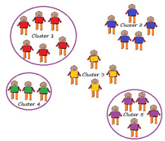
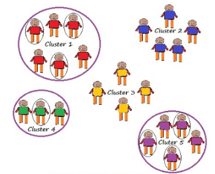

# Sampling

**Population:** The collection of data related to the subject under study and number of individuals in the population is callec poulation size, denoted by 'N'.

**Sample:** A finite subset of statistical individuals in a population is called a sample and number of individuals in a sample is called sample size, denoted by 'n'.

In any kind of survey, working with the whole population is impractical, so instead we use some statistical sampling techniques to get a sample that can represent the population as much as possible. Sampling is a method that allows researchers to infer information about a population based on results from a subset of the population, without having to investigate every individual. Reducing the number of individuals in a study reduces the cost and workload, and may make it easier to obtain high quality information, but this has to be balanced against having a large enough sample size with enough power to detect a true association.

Types of sampling:
## Probability sampling

### Simple random sampling

In this sampling method the sampling units are selected from the population in a random manner. There are two types of simple random sampling.

1. Simple random sampling without replacement(SRSWOR):

In this method, when we randomly select a unit from population, it is not replaced back to the population, so the probablity of chosing next element from the population is 1/(N-1), since the previously selected unit is removed from the population.

2. Simple random sampling with replacement(SRSWR):

In this method the probablity of selection of any element from the population is always 1/(N) at every stage.

### Systematic sampling

Sampling units are selected at regular intervals from teh sampling frame. The intervals are chosen to ensure an adequate sample size. If we need a sample size n from a population of size N, you should select every (N/n)th unit for the sample. Systematic sampling is more convenient that simple random sampling, but it may lead to bais in case the data collected has a patter of sorted order or similar.

### Stratified sampling

The entire heterogenous population is divided into a number of homogenous groups, usually termed asstrata, which differ from one another but each of these gourps is homogenous within itself. Then units are sampled at random from each of these stratum, the sample size in each stratum varies according tothe relative imortance of the stratum in the population. The sample, which is the aggreate of the sampled units of each of the stratum, is termed as stratified sample and the technique of drawing  this sample is known as stratified sampling. Such a sample is by far the best and can safely be considered as representative of the population from which it has been drawn.

### Cluster Sampling

Our entire population is divided into clusters or sections and then the clusters are randomly selected. All the elements of the cluster are used for sampling. Clusters are identified using details such as age, sex, location etc.

Cluster sampling can be done in following ways:

* Single stage cluster sampling

Entire cluster is selected randomly for sampling.

   

* Two stage cluster sampling

Here first we randomly select clusters and then from those selected clusters we randomly select elements for sampling.

   

## Non-probablity sampling

It does not rely on randomization. This technique is more reliant on the researcher’s ability to select elements for a sample. Outcome of sampling might be biased and makes difficult for all the elements of population to be part of the sample equally. This type of sampling is also known as non-random sampling.

### Convenience sampling

Here the samples are selected based on the availability. This method is used when the availability of sample is rare and also costly. So based on the convenience samples are selected.

### Purposive sampling

This is based on the intention or the purpose of study. Only those elements will be selected from the population which suits the best for the purpose of our study.

### Quota sampling

This type of sampling depends of some pre-set standard. It selects the representative sample from the population. Proportion of characteristics/ trait in sample should be same as population. Elements are selected until exact proportions of certain types of data is obtained or sufficient data in different categories is collected.

### snowball sampling

This technique is used in the situations where the population is completely unknown and rare. Therefore we will take the help from the first element which we select for the population and ask him to recommend other elements who will fit the description of the sample needed. So this referral technique goes on, increasing the size of population like a snowball.

source:

Gupta SC and VK Kapoor Fundamentals of Mathematical Statistics , [towardsdatascience](https://towardsdatascience.com/sampling-techniques-a4e34111d808), [MATH 417](http://home.iitk.ac.in/~shalab/course1.htm)
